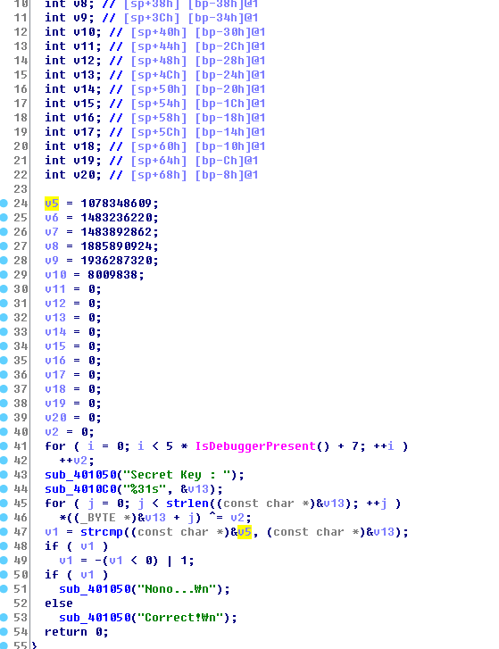

# [2017 Layer7 CTF] DO NOT TOUCH ME! - Writeup

## Inverse Operation



그냥 간단히 역연산해주면 된다.

``` python
a = "\x41\x4B\x46\x40\x7C\x63\x68\x58\x7E\x68\x72\x58\x6C\x69\x68\x70\x58\x66\x69\x73\x6E\x38\x7A"
for i in range(len(a)):
	print(chr(ord(a[i]) ^ 7), end='')
```
```
FLAG{do_you_know_anti?}
```

___

## Answer

flag: `do_you_know_anti?`