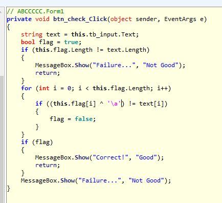

# [2017 Layer7 CTF] IDENTIFICATION - Writeup

## Inverse Operation



.NET 프로그램인데, 역연산해주면 된다.

``` python
flag = "AKF@|D$D$D$D$z"

for i in range(len(flag)):
    print(chr(ord(flag[i]) ^ 7), end='')
```
```
FLAG{C#C#C#C#}
```

___

## Answer

flag: `C#C#C#C#`